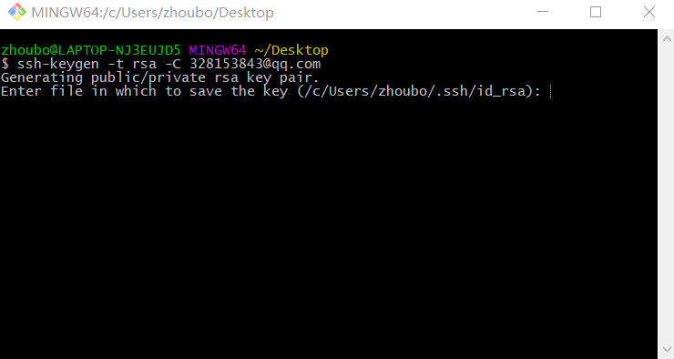
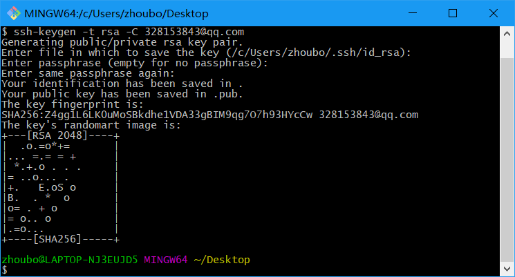
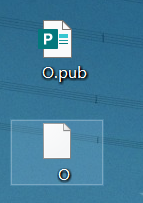
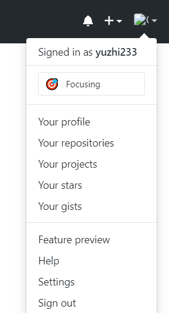
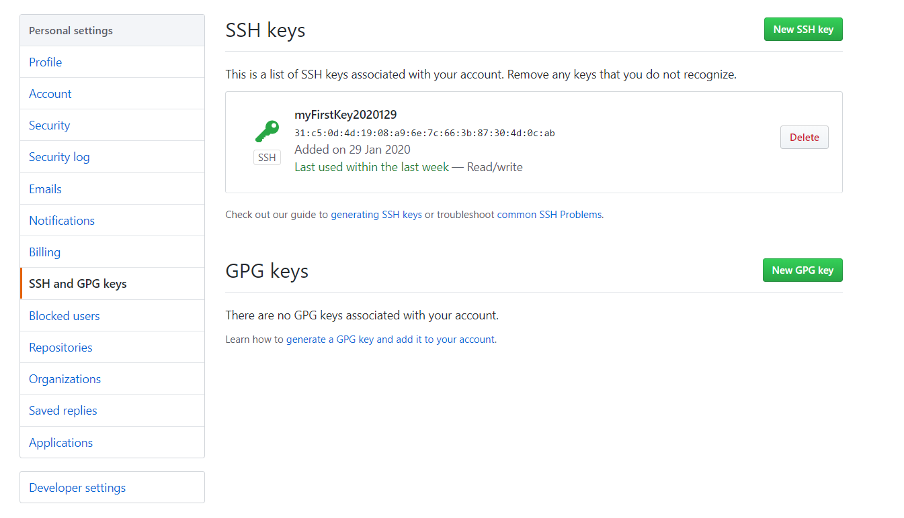
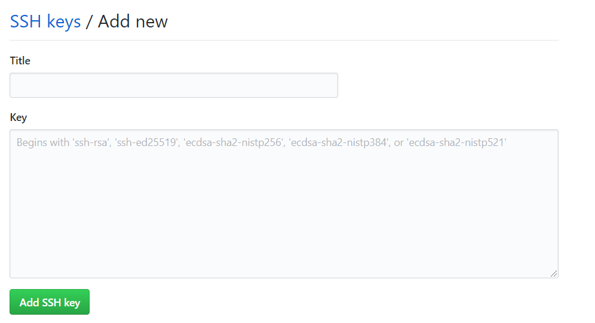
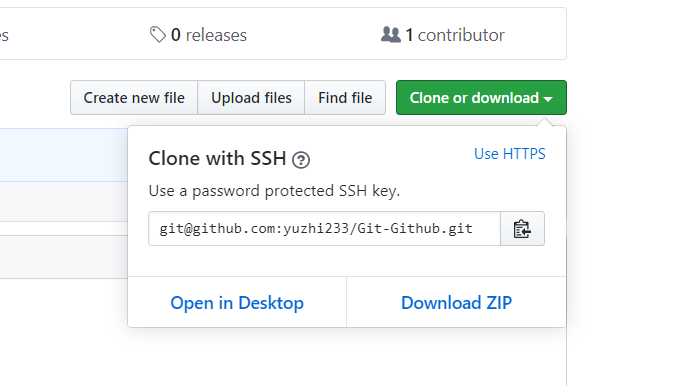

# Git-Github

小白老忘，记录一下，避免重复造轮子作无用功。。吐辽，针对自己的弱智行为 = =

首先注册啥的不说了不然我也上不了Github.

主要参考视频https://www.bilibili.com/video/av55780016（b站大法好）

​        参考文章 https://www.jianshu.com/p/3ef797fcb17d

### 第一步

默认GIT装完了（装GIT就不写了）

要想本地和github完成连接，嗯，首先先创建连接（废话），这里是学人家用SSH创建一个本地连接SSHkey

运行**Git Bash**

在打开的窗口中输入如下指令

~~~bash
ssh-keygen -t rsa -C "邮件地址"// 填写你的github注册邮箱
~~~

回车回车回车然后：

表示生成完了，我在桌面bash的生成的文件默认路径也是桌面。

这o.pub这个是我们需要的，右键notepad++打开复制一下SSHkey完事。

### 第二步

点击头像下的setting

找到SSH and GPG keys 我已经创建了个，第一次的话new一个完事。

 

Title下面起个标题（体现哪台电脑比较好）

然后key就是第一步赋值的那个东西填进去。生成完就建立了本地电脑跟远程github的SSH连接。

### 第二步

先在Github端建立一个repository，简单8多说。

然后点击这里

把右上角USE HTTPS改成 USE SSH  （好像大佬都说用SSH更好）HTTPS我没用也懒得知道咋用以后再说8.

然后复制完后找个你存放这个repository的文件夹，在文件夹里bash一下，输入

~~~bash
git clone git@github.com:yuzhi233/Git-Github.git #刚才复制的SSH链接
~~~

完了你会发现自动下载好了，并且里面已经有了隐藏的.git文件夹（貌似不需要git init了）

### 第三步

就是使用了。

小白为了防止头疼，记了几个常用且简单的，剩下的需要用到再google吧

**更新本地仓库**（如果你在云端编辑了，在本地的时候可以这样）

~~~git
git pull
~~~

查看暂存区状态

~~~git
git status
~~~

**添加到暂存区**

~~~git
git add .  #添加文件夹下所有文件
git add 文件名.后缀  #添加单个文件
~~~

有时候会遇到不小心添加错文件到暂存区，这时候

~~~git
git reset HEAD 取消所有暂存区文件
~~~

**提交**到工作区

~~~git
git commit -m '版本修改的信息'
~~~

查看git日志（commit的信息）

~~~git
git log
~~~

推送到Github

~~~git
git push
~~~

### Git用法补充（遇到的）

2020/2/20 今天学习的时候又碰到的问题，使用git上传文件时候不小心上传了超过100M的，导致commit以及以后的git push报错，无法更新云端，反正错误大概看出来是由于上传文件过大导致。

最后先还原了之前的版本

**还原之前版本**

~~~git
git log  #查看commit的信息，找到之前一个合适的版本 记录下hash值
~~~

~~~git
git reset --hard a518cef96b4dfe592139f4187bbd2656e532369a #然后repo就会变成你选择的那个版本
~~~

这tm才是git的精髓好8 ,  = =...趁机又了解了咋还原版本  不得不说git挺方便的

但是.....还原后我把原来仓库文件索性直接删完，又复制了最新的文件进去，但是push还是报错

error: failed to push some refs to 'git@github.com:yuzhi233/PytorchStudy.git'
hint: Updates were rejected because the remote contains work that you do
hint: not have locally. This is usually caused by another repository pushing
hint: to the same ref. You may want to first integrate the remote changes
hint: (e.g., 'git pull ...') before pushing again.
hint: See the 'Note about fast-forwards' in 'git push --help' for details.

查网，大概是你本地repo与云端差异太大了，git貌似会认为你push错了？？就不让你push

。。所以我又搜到了  

**强行push，本地为基础覆盖云端**：

~~~git
git push -f #强力
~~~

然后云端正常了。。以后还是尽量不要上传大于100M的太麻烦了。